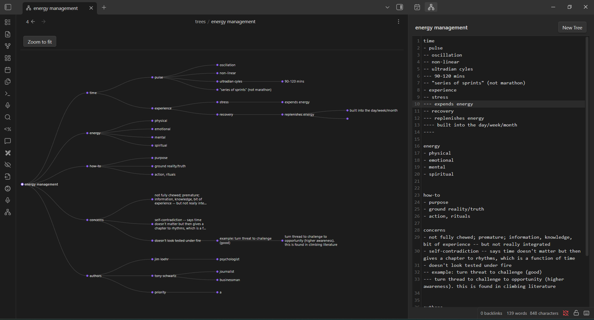

# ObsTree

Obsidian plugin that turns a dash-indented text outline into an interactive dendrogram — the
core capability of [notes2tree.com](https://notes2tree.com), native to your vault.



## Syntax

Depth = number of leading `-` characters. A line with no leading dash starts a new top-level
block; all top-level blocks become children of one root node (the note's first `# H1`, or its
filename if there's no H1).

```
time
- pulse
-- oscillation
-- non-linear
-- ultradian cycles
--- 90-120 mins
-- "series of sprints" (not marathon)

energy
- physical
- emotional
- mental
- spiritual
```

## Two ways to use it

- **Inline in any note**: wrap the outline in a ` ```tree ` fenced code block. Renders inline in
  Reading view and Live Preview, updating whenever the block's text changes.
- **Dedicated `.ntr` files**: a standalone tree file. The main pane is a preview-only canvas;
  editing happens in the **ObsTree sidebar** (see below) so you always see the live dendrogram
  next to what you're typing, instead of switching between an edit mode and a preview mode.

### Creating a `.ntr` file

- **Right-click a folder** in the file explorer → **New tree** — the location is already known
  from the click, so this just asks for a name and creates it there immediately.
- **Ribbon icon** (or the "Toggle ObsTree sidebar" command) opens the sidebar. If no tree is
  currently focused, it asks which folder and name to create one with.
- **"New tree note"** command — same folder/name prompt, from anywhere.

## The ObsTree sidebar

Click the ribbon icon to toggle a right-sidebar panel containing a real editor (the same
CodeMirror engine Obsidian's own notes use — undo/redo, selection, and Ctrl+F search all work),
similar to a chat sidebar. It always edits whichever `.ntr` file was most recently focused in
the main area — type there, and the dendrogram in the main pane updates live.

The sidebar header has four icon buttons: **outdent** / **indent** (apply to the current
selection — the toolbar equivalent of Shift-Tab/Tab below), **↗** re-opens/switches to the
currently-bound tree's tab (handy if the sidebar is still pointed at a tree whose tab you've
since navigated away from), and **+** creates a new tree (asks where).

**Tab / Shift-Tab** on one or more selected lines adds/removes a leading `-`, pushing them one
level deeper or shallower — the outline equivalent of indent/outdent.

## Renaming the root node

The root node's label defaults to the file's H1 (markdown notes) or filename (`.ntr` files), but
you can override it explicitly:

- Right-click a `.ntr` file in the file explorer → **Rename tree**.
- Run the **"Rename tree"** command while a tree is open.
- Click the tree's name at the top of the ObsTree sidebar — it's underlined with a pencil icon
  next to it to show it's clickable.

Clearing the name (or setting it back to the filename) removes the override.

## Long node text

Labels word-wrap up to 3 lines; anything beyond that is ellipsis-truncated. Click a truncated
label to see the full text in a popover (dismiss with Escape or by clicking elsewhere). Sibling
spacing scales with how many lines a node wraps to, so long labels get more vertical room
instead of overlapping their neighbors.

## Fit mode

The dendrogram starts in "fit" mode — zoomed to show the whole tree — and stays there as you
type, so newly added nodes are automatically kept in view. Manually panning/zooming, or
navigating into a specific node (click, or Enter/Space on a focused node), switches out of fit
mode so your view isn't yanked around. Press **Escape**, click the root node, or hit **"Zoom to
fit"** to snap back to fit mode.

## Interacting with the dendrogram

- **Scroll / pinch** — zoom, cursor-anchored.
- **Drag** — pan.
- **Click a node**, or focus the canvas and use **arrow keys** — `↓`/`↑` move through the tree,
  `←` jumps to the parent, `→` jumps to the first child.
- **Enter / Space** — zoom to fit the focused node's subtree.
- **Escape** — zoom to fit the whole tree.

A floating control cluster in the bottom-right corner mirrors all of this with clickable
buttons — a directional pad (↑↓←→ plus a center "zoom to fit"), a +/− zoom widget with a live
percentage readout, and an export button — so nothing here requires the keyboard. It's part of
the dendrogram itself, so it shows up identically in a `.ntr` file's main pane and in an inline
` ```tree ` code block.

## Exporting

The control cluster's export button (⬇) offers **PNG**, **JPEG**, and **HTML**. All three export
the *whole* tree (not just what's currently visible/panned/zoomed to) using a fixed dark palette,
so the file looks right on its own outside Obsidian regardless of your current theme.

## Install

### Option A — BRAT (recommended, no manual files)

1. Install the **BRAT** community plugin (Settings → Community plugins → Browse → search "BRAT").
2. BRAT settings → "Add beta plugin" → paste this repo's URL: `https://github.com/shrsv/ObsTree`.
3. Enable "ObsTree" under Settings → Community plugins.

### Option B — Manual

1. Download `main.js`, `manifest.json`, `styles.css` from the [latest release](../../releases/latest).
2. Create `<your-vault>/.obsidian/plugins/obs-tree/` and place the three files inside it.
3. Settings → Community plugins → turn off "Restricted mode" if needed → enable "ObsTree".

## Settings

Open Settings → ObsTree to configure the default folder for new `.ntr` files, root-label
behavior, node color theme, and live-update delay. Keyboard shortcuts for "New tree note" and
"Toggle ObsTree sidebar" can be rebound from there too (pan/zoom/arrow-key navigation inside the
canvas itself are not separately rebindable — they're always on while the canvas has focus).

## Scope

v1 ships the dendrogram view only — no AI-derived views (timelines, flowcharts, etc.), and no
LLM calls anywhere in the plugin. The parser and renderer are architected separately
(`src/parser.ts` vs. `src/renderers/`) so more view types can be added later without touching how
outlines are parsed. See `AGENTS.md` for the architecture.

## Development

```
npm install
npm run dev    # watch build
npm run build  # production build
```

To cut a release: `make release VERSION=x.y.z` — bumps the version, commits, tags, and pushes;
GitHub Actions builds and publishes the release assets automatically.
